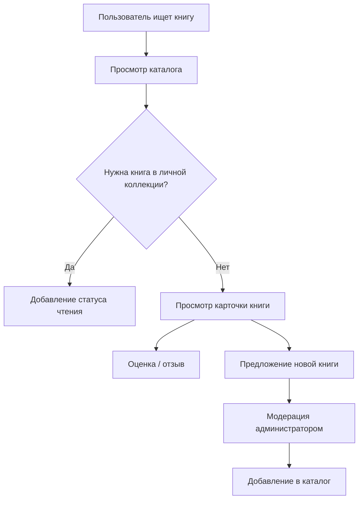
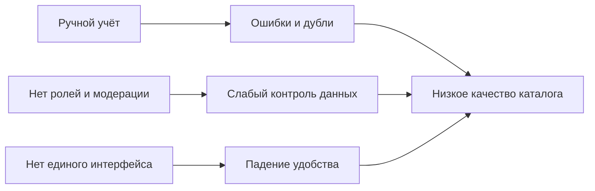
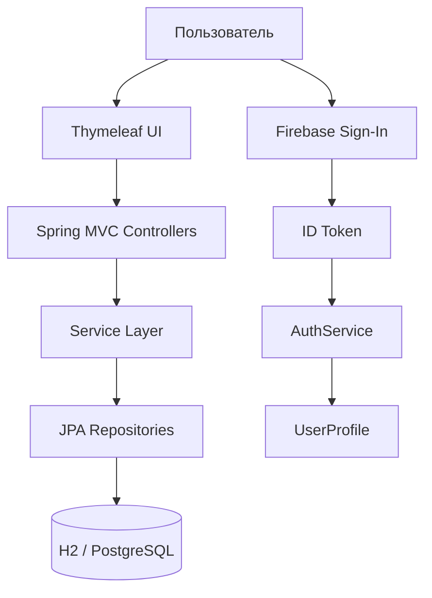
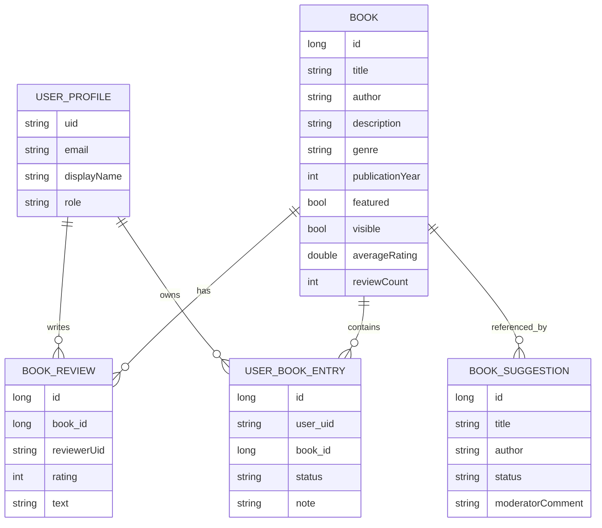
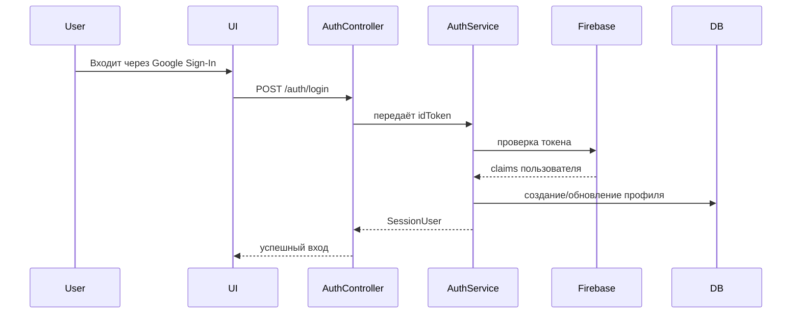
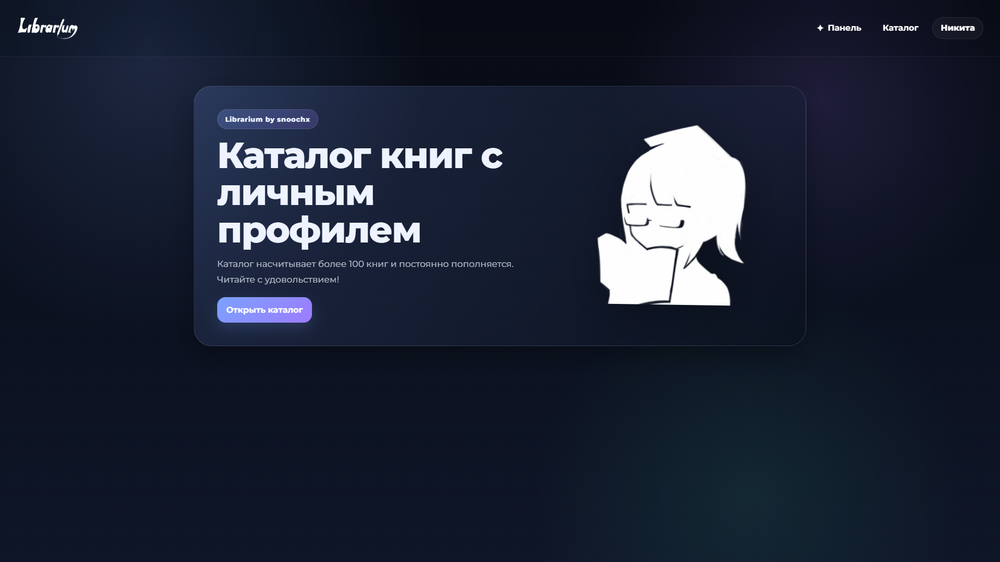

# Librarium

**Librarium** — веб-приложение на **Java / Spring Boot** для управления книжным каталогом, личной коллекцией, отзывами и модерацией пользовательских предложений.  
Проект реализует полный цикл работы с книгами: от просмотра публичного каталога до администрирования, добавления, редактирования и удаления записей.

---

## 1. Анализ ситуации и контекста

### Содержание проблемы

Во многих небольших библиотеках, учебных проектах и личных книжных каталогах данные о книгах ведутся разрозненно: в Excel-таблицах, заметках, чатах или вручную в административной панели без единого пользовательского сценария.  
Это приводит к нескольким типичным проблемам:

- сложно быстро найти нужную книгу по названию, автору или году;
- отсутствует удобный личный учёт прочитанного;
- пользователи не могут оставлять оценки и отзывы в одном месте;
- новые книги и предложения поступают без прозрачной модерации;
- администрирование каталога требует ручной работы и не защищено ролью доступа.

### Влияние проблемы

Такая организация работы приводит к:

- потере времени на поиск и обновление данных;
- снижению качества каталога из-за дублей и неактуальной информации;
- росту ошибок при ручном редактировании;
- отсутствию прозрачности в работе с пользовательскими предложениями;
- слабой вовлечённости пользователей, так как нет удобного механизма оценок, статусов чтения и профиля.

### Контекст

Проблема возникает в процессе управления цифровым книжным фондом, когда требуется одновременно обслуживать:

- публичный просмотр каталога;
- персональную работу пользователя с книгами;
- модерацию контента администратором;
- хранение данных в надёжной БД;
- безопасную авторизацию через внешний провайдер.

### Текущий процесс



### Корни проблемы



---

## 2. Обзор существующих решений

Для подобных задач обычно применяются следующие подходы.

| Решение | Преимущества | Недостатки |
|---|---|---|
| Таблицы и ручной учёт | Просто начать, не требует разработки | Нет ролей, поиска, отзывов и истории изменений |
| Готовые библиотечные системы | Много функций, зрелые механизмы | Сложная настройка, избыточность для небольшого проекта |
| Конструкторы сайтов / CMS | Быстрый запуск, визуальное управление | Ограниченная логика, слабая связь с БД и бизнес-процессом |
| Небольшое веб-приложение на Spring Boot | Гибкая логика, контроль структуры, расширяемость | Требует разработки и поддержки |

### Выбор подхода

Для данной задачи выбран **монолитный веб-проект на Spring Boot** с серверной отрисовкой страниц через Thymeleaf. Такой подход даёт:

- быстрый запуск и простое локальное развёртывание;
- понятную структуру проекта;
- удобную модификацию бизнес-логики;
- возможность хранить данные в H2 локально и в PostgreSQL на проде;
- реализацию как пользовательской части, так и административной панели в одном решении.

### Ключевой вывод

Для учебного и демонстрационного проекта наиболее оправдано решение, где:
- backend и frontend находятся в одном Java-проекте;
- есть полноценная CRUD-логика;
- присутствуют авторизация, роли и модерация;
- данные сохраняются в реляционной базе.

---

## 3. Концепция решения

### Суть подхода

Librarium решает задачу единого цифрового каталога книг.  
Пользователь может:

- войти через Google Sign-In;
- просматривать каталог;
- искать и сортировать книги;
- открывать карточку книги;
- ставить оценку и оставлять отзыв;
- вести личный список книг со статусами чтения;
- предлагать новые книги.

Администратор может:

- добавлять книги в каталог;
- редактировать карточки книг;
- удалять записи;
- обрабатывать предложения пользователей;
- переводить предложенные книги в основной каталог.

### Как работает решение

1. Пользователь проходит авторизацию через Firebase.
2. Система проверяет ID token и создаёт/обновляет профиль пользователя.
3. Каталог книг загружается из базы данных.
4. Пользователь взаимодействует с книгами через карточки, отзывы и статусы чтения.
5. Предложенные книги попадают в очередь модерации.
6. Администратор через отдельную панель управляет каталогом и предложениями.

### Основные компоненты

- **Frontend на Thymeleaf** — страницы каталога, книги, профиля и админ-панели.
- **Spring Boot backend** — контроллеры, сервисы и безопасность.
- **JPA / Hibernate** — работа с сущностями и репозиториями.
- **H2 / PostgreSQL** — локальное и продакшн-хранилище.
- **Firebase Auth** — подтверждение личности пользователя.
- **Ролевой доступ** — `USER` и `ADMIN`.

### Принципиально новые элементы в комбинации

В проекте объединены:

- публичный книжный каталог;
- личная коллекция с состояниями чтения;
- отзывы и оценки;
- модерация пользовательских предложений;
- административный CRUD;
- авторизация через внешнего провайдера.

### Ключевое преимущество

Главное преимущество Librarium — это **единое приложение**, в котором совмещены каталог, личный кабинет, отзывы, модерация и администрирование.  
Это делает систему удобной как для обычного пользователя, так и для администратора.

### Схема взаимодействия компонентов



---

## 4. Архитектура решения и детализация внедрения

### Общая архитектура

Проект построен по классической слоистой схеме:

- **Controller** — принимает HTTP-запросы и формирует ответы;
- **Service** — содержит бизнес-логику;
- **Repository** — работает с БД;
- **Entity** — описывает структуру таблиц;
- **Template / static** — формирует интерфейс.

### Технологический стек

- **Java 21**
- **Spring Boot 3.4.3**
- **Spring MVC**
- **Spring Data JPA**
- **Thymeleaf**
- **Bean Validation**
- **H2 Database**
- **PostgreSQL**
- **Firebase Google Sign-In**
- **Nimbus JOSE + JWT**
- **Lombok**

### Схема модулей проекта

```text
src/main/java/ru/librarium
├── config         # настройки приложения и веб-конфигурация
├── controller     # HTTP-слой
├── dto           # формы и запросы
├── entity        # сущности БД
├── repository    # доступ к данным
├── service       # бизнес-логика
└── LibrariumApplication.java
```

### Основные сущности БД

- **Book** — книга каталога;
- **BookReview** — отзыв с рейтингом;
- **BookSuggestion** — предложение пользователя;
- **UserProfile** — профиль пользователя;
- **UserBookEntry** — личная запись о книге и статусе чтения.

### Логика работы

#### Каталог
- поиск по тексту;
- сортировка;
- пагинация;
- скрытие/показ книг через флаг `visible`;
- карточка книги с рейтингом и отзывами.

#### Личный кабинет
- редактирование имени;
- список книг пользователя;
- статусы: `PLANNED`, `IN_PROGRESS`, `READ`, `DROPPED`, `NOT_READ`;
- заметка к книге;
- управление отзывами.

#### Админ-панель
- создание книги;
- редактирование книги;
- удаление книги;
- просмотр предложений;
- одобрение и отклонение заявок.

### Схема базы данных



### Алгоритм работы авторизации



### Ресурсные затраты

Проект рассчитан на умеренную нагрузку и может запускаться локально на обычном рабочем компьютере.  
Для работы достаточно:

- JDK 21;
- Maven;
- локальная H2-база или PostgreSQL;
- доступ к Firebase-проекту для авторизации.

---

## Практическая часть

В проекте реализован рабочий прототип веб-приложения на Java, который подтверждает работоспособность идеи.

### Что уже работает

- добавление, редактирование и удаление книг;
- поиск и сортировка каталога;
- карточка книги;
- личный кабинет;
- управление статусами чтения;
- оценки и отзывы;
- предложения новых книг;
- модерация предложений;
- административная панель;
- авторизация через Firebase.

### Ключевой элемент прототипа

Ключевой элемент решения — **единый книжный каталог с полным циклом обработки данных**:

1. книга добавляется в админке;
2. пользователь видит её в каталоге;
3. он может добавить её в личную коллекцию;
4. оставить отзыв и оценку;
5. предложить новую книгу;
6. администратор принимает решение по предложению.

### Минимальный сценарий работы

1. Запустить приложение.
2. Открыть `/catalog`.
3. Войти через авторизацию.
4. Добавить книгу в личный список.
5. Поставить оценку.
6. Перейти в админ-панель и изменить запись книги.

---

## Запуск проекта локально

### Вариант 1. H2 (по умолчанию)

```bash
mvn spring-boot:run
```

После запуска приложение будет доступно по адресу:

```text
http://localhost:8080
```

Дополнительно доступна H2 Console:

```text
http://localhost:8080/h2-console
```

### Вариант 2. PostgreSQL

Поднять контейнеры:

```bash
docker compose up -d
```

Запуск приложения с продакшн-профилем и переменными окружения:

```bash
export SPRING_PROFILES_ACTIVE=prod
export DATABASE_URL=jdbc:postgresql://localhost:5432/librarium
export DATABASE_USERNAME=librarium
export DATABASE_PASSWORD=librarium
mvn spring-boot:run
```

---

## Firebase

В проекте используется Firebase Google Sign-In.  
После входа ID token отправляется на backend, где:

- проверяется подпись токена;
- проверяется `aud` токена;
- создаётся или обновляется профиль пользователя;
- пользователю назначается роль по email.

Текущий `projectId`:

```text
librarium-dd543
```

---

## Роли и доступ

Роль администратора назначается по email из списка `librarium.admin-emails`.

Пример:

```yaml
librarium:
  admin-emails:
    - admin@librarium.ru
```

Если email совпадает с одним из значений в списке, пользователь получает роль `ADMIN`.  
Во всех остальных случаях назначается `USER`.

---

## Структура проекта

```text
src/main/java/ru/librarium
├── config
├── controller
├── dto
├── entity
├── repository
├── service
└── LibrariumApplication.java
```

---

## Демонстрация работы (Ссылка на скачивание)

[](https://github.com/snoochx/librarium/releases/download/release-1.0/video.mp4)

---

## Результат

Librarium представляет собой полноценный учебный и демонстрационный проект на Java, который показывает:

- работу с Spring Boot и JPA;
- построение веб-приложения с серверной отрисовкой;
- авторизацию через Firebase;
- организацию пользовательских и административных сценариев;
- проектирование реляционной модели данных;
- реализацию CRUD-функций для книжного каталога.
