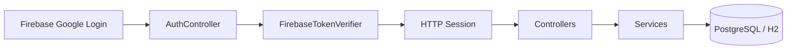
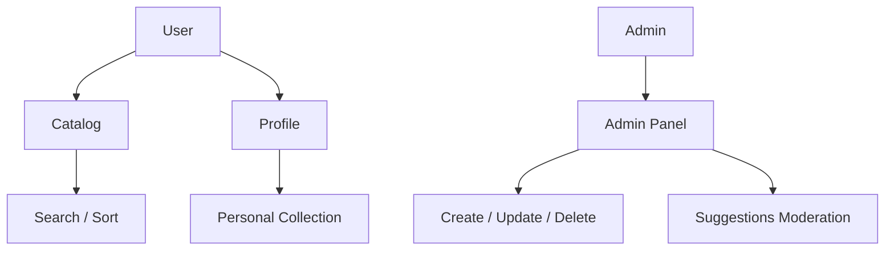

# Librarium

Librarium — Spring Boot-платформа для управления книжным каталогом, личной коллекцией и модерацией предложений.

## Что умеет проект

- вход через Firebase Google Sign-In;
- роли `ADMIN` и `USER`;
- публичный каталог книг с поиском и сортировкой;
- карточка книги с оценками и отзывами;
- личный профиль со статусами чтения: `PLANNED`, `IN_PROGRESS`, `READ`, `DROPPED`;
- предложение книг пользователями и модерация админом;
- админ-панель для добавления, редактирования и удаления книг.

## Что было исправлено

- иконки вынесены в `src/main/resources/static/icons`;
- имя пользователя теперь сохраняется в БД и не сбрасывается при повторном входе;
- карточки книг больше не поднимаются при наведении — остаётся только мягкое выделение;
- главная страница упрощена и приведена к новому текстовому макету;
- в каталоге показывается общее количество книг;
- добавлен стартовый набор из 500 книг для демонстрации каталога.

## Архитектура





## Запуск локально

### 1. С H2 (по умолчанию)

```bash
mvn spring-boot:run
```

Открой: `http://localhost:8080`

### 2. С PostgreSQL

Подними базу:

```bash
docker compose up -d
```

Запусти приложение с профилем prod и переменными окружения:

```bash
export SPRING_PROFILES_ACTIVE=prod
export DATABASE_URL=jdbc:postgresql://localhost:5432/librarium
export DATABASE_USERNAME=librarium
export DATABASE_PASSWORD=librarium
mvn spring-boot:run
```

## Firebase

В проекте уже прописан `projectId` из конфига:

- `librarium-dd543`

Для фронта используется Google Sign-In через Firebase. После успешного входа ID token отправляется на backend, где проверяется подпись и `aud` токена.

## Роли

Роль админа назначается по email из `librarium.admin-emails`.

Пример:

```yaml
librarium:
  admin-emails:
    - admin@librarium.ru
```

## Структура проекта

```text
src/main/java/ru/librarium
├── config
├── controller
├── dto
├── entity
├── repository
├── service
└── LibrariumApplication.java
```
